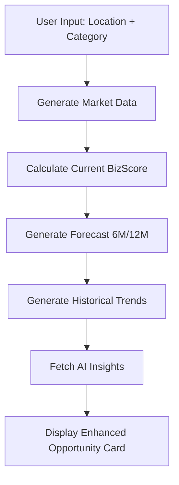

# BizRadar - Version 2.0
## AI-Powered Business Opportunity Forecasting Platform

**Upgrade Highlights:** Enhanced with Predictive Forecast Engine, Historical Trend Analysis, BizScore 2.0, and AI-Powered Insights.

---

## 🚀 New Features in Version 2

### 1. **Predictive Forecast Engine**
- **6-month and 12-month projections** for demand and competition
- **Future BizScore calculations** using growth rate formulas
- **Trend direction indicators**: Growing ↑, Stable →, Declining ↓
- **Category-specific growth rates**:
  - Food & Beverage: 15% annual
  - Retail: 10% annual
  - Technology: 25% annual
  - Education: 18% annual
  - Health & Wellness: 20% annual

### 2. **Historical Trend Simulation**
- **6-month historical data** visualization
- **Interactive charts** for:
  - Demand trends over time
  - Competition evolution
  - Growth potential trajectory
- Built with **Recharts** for responsive, animated visualizations

### 3. **BizScore 2.0 - Enhanced Scoring Model**

#### New Formula:
```
BizScore = (0.4 × demandIndex) 
         + (0.2 × forecastGrowth) 
         + (0.2 × populationDensity) 
         + (0.2 × competitionPenalty)
```

Where:
- `competitionPenalty = 100 - (competitionIndex × 0.1)`
- Score is clamped between 0-100

#### Outputs:
- **BizScore Today**: Current market score
- **BizScore 6M**: 6-month projection
- **BizScore 12M**: 12-month projection
- **Risk Level**: Automatically calculated
- **Growth Category**: Stable / Emerging / High Growth

### 4. **AI-Powered Insight Generator**
Uses **Lovable AI (Gemini 2.5 Flash)** to provide:
- **Opportunity description** (concise 2-sentence summary)
- **Category outlook** (market direction + reasoning)
- **Risk-to-reward ratio** (Low/Medium/High + key factors)
- **Actionable recommendation**:
  - ✅ Start Now
  - ⏸️ Wait
  - ❌ Avoid

---

## 📁 Architecture & File Structure

```
src/
├── services/
│   ├── forecastEngine.ts      # Predictive forecasting logic
│   ├── trendSimulator.ts      # Historical trend generation
│   ├── scoring.ts             # BizScore 2.0 calculation (updated)
│   ├── marketData.ts          # Market data generation
│   └── geocoding.ts           # Location services
│
├── components/
│   ├── ForecastPanel.tsx      # 6M & 12M forecast display
│   ├── TrendCharts.tsx        # Historical trend visualizations
│   ├── BizScoreEvolution.tsx  # Score progression component
│   ├── OpportunityCardEnhanced.tsx  # Enhanced opportunity cards
│   └── [existing components...]
│
├── pages/
│   ├── Opportunities.tsx      # Main analysis page (updated)
│   └── [other pages...]
│
└── supabase/
    └── functions/
        └── generate-insights/
            └── index.ts       # AI insight generation endpoint
```

---

## 🔧 Technical Implementation

### Forecast Engine (`forecastEngine.ts`)
**Purpose:** Predicts future market conditions using growth rate formulas

```typescript
futureValue = currentValue × (1 + growthRate)
```

**Key Functions:**
- `generateForecast()`: Returns 6M and 12M projections
- Category-based annual growth rates
- Trend direction calculation (growing/flat/declining)

### Trend Simulator (`trendSimulator.ts`)
**Purpose:** Generates realistic historical trend data

**Features:**
- 6-month lookback with simulated volatility
- Demand trends (upward bias)
- Competition trends (slower growth)
- Growth potential calculation

**Key Functions:**
- `generateHistoricalTrends()`: Returns time-series arrays
- `getTrendBadge()`: Returns visual indicators

### BizScore 2.0 (`scoring.ts`)
**Enhancements:**
- 40% weight on demand (up from 50%)
- 20% weight on forecast growth (new)
- 20% weight on population density
- 20% weight on competition penalty

### AI Insights (`supabase/functions/generate-insights/`)
**Backend Function:**
- Uses **Lovable AI Gateway**
- Model: `google/gemini-2.5-flash`
- Input: Market metrics + forecast data
- Output: Human-friendly analysis (< 150 words)

**Error Handling:**
- Rate limit detection (429)
- Payment required handling (402)
- Graceful fallback messaging

---

## 🎨 UI Components

### ForecastPanel
- **6-month outlook** with demand/competition indices
- **12-month outlook** with BizScore projection
- **Trend badges** and **growth rate display**
- Color-coded score changes

### TrendCharts
- **Market Dynamics Chart**: Demand vs Competition over time
- **Growth Potential Chart**: Combined growth index
- Responsive design with Recharts
- Interactive tooltips

### BizScoreEvolution
- **Current score** with progress bar
- **6M and 12M projections** with change indicators (+/-)
- **Visual gauge** for score progression
- **Summary badge** (Strong/Declining/Stable)

### OpportunityCardEnhanced
**4 Tab Interface:**
1. **Overview**: Investment, profit potential, demand, category
2. **Forecast**: 6M/12M projections with ForecastPanel
3. **Trends**: Historical charts with TrendCharts
4. **AI Insights**: Real-time AI analysis with loading states

---

## 🚦 How to Use Version 2

### For Users:
1. Navigate to **Opportunities** page
2. Enter location and select business category
3. Click **Analyze**
4. View enhanced opportunity cards with:
   - **Overview tab**: Key metrics and BizScore evolution
   - **Forecast tab**: Future projections
   - **Trends tab**: Historical performance
   - **AI Insights tab**: Intelligent recommendations

### For Developers:
```bash
# Install dependencies (if needed)
npm install

# Run development server
npm run dev

# Build for production
npm run build
```

**Environment Variables** (auto-configured):
- `VITE_SUPABASE_URL`
- `VITE_SUPABASE_PUBLISHABLE_KEY`
- `LOVABLE_API_KEY` (backend only)

---

## 📊 Data Flow



---

## 🔮 Future Roadmap (Version 3)

### Planned Enhancements:
- [ ] **Real Data Integration**
  - Connect to live market APIs
  - Actual competitor scraping
  - Real-time demand tracking

- [ ] **ML-Based Forecasting**
  - Replace static growth rates with trained models
  - Time-series prediction (ARIMA/Prophet)
  - Seasonality detection

- [ ] **Advanced Analytics**
  - Sensitivity analysis
  - Monte Carlo simulations
  - What-if scenario modeling

- [ ] **Geo-Based Dynamic Trends**
  - Neighborhood-level heatmaps
  - Competitor clustering
  - Foot traffic data integration

- [ ] **User Accounts & Saved Reports**
  - Save favorite opportunities
  - Track analysis history
  - Custom watchlists

---

## 🛠️ Technology Stack

| Component | Technology |
|-----------|-----------|
| **Frontend** | React 18 + TypeScript |
| **UI Framework** | Tailwind CSS + shadcn/ui |
| **Charts** | Recharts |
| **Backend** | Lovable Cloud (Supabase) |
| **Edge Functions** | Deno Runtime |
| **AI Provider** | Lovable AI (Gemini 2.5 Flash) |
| **Routing** | React Router v6 |
| **Build Tool** | Vite |

---

## 📝 Version History

### Version 2.0 (Current)
✅ Forecast Engine with 6M/12M projections  
✅ Historical Trend Simulation with charts  
✅ BizScore 2.0 enhanced formula  
✅ AI-Powered Insight Generator  
✅ Enhanced UI with tabbed opportunity cards  
✅ Real-time AI analysis integration  

### Version 1.0
- Basic opportunity search
- Static market data generation
- Original BizScore calculation
- Map visualization
- Feasibility reports

---

## 🤝 Contributing

This is a modular, extensible architecture designed for future upgrades:
- **Services** are pure functions for easy testing
- **Components** are reusable and well-documented
- **Edge functions** are isolated for independent deployment
- **Types** are strictly defined for TypeScript safety

---

## 📄 License

Built with ❤️ using Lovable  
© 2025 BizRadar v2.0

---

## 🔗 Quick Links

- [Lovable Cloud Documentation](https://docs.lovable.dev/features/cloud)
- [Lovable AI Documentation](https://docs.lovable.dev/features/ai)
- [Recharts Documentation](https://recharts.org/)
- [Tailwind CSS](https://tailwindcss.com/)
